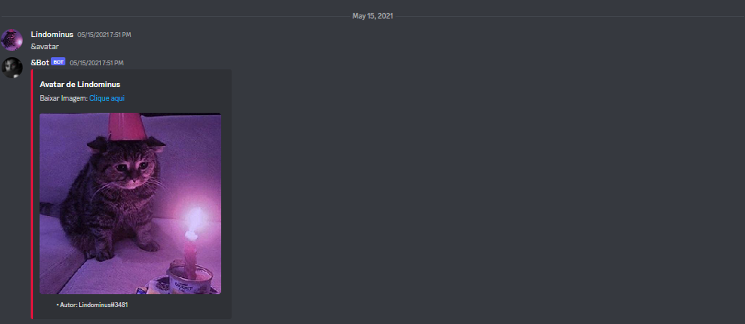

<p align="center">
  
</p>

<h1 align="center">Discord Bot</h1>
<p align="center">Simple bot for discord using Discord.js v12</p>

<h3 align="center">
  
 <!-- Status -->
 

 <!-- License -->
  <a href="./LICENSE" target="_blank">
    
  </a>
  
 <!-- Forks -->
 

 <!-- Stars -->
  

</h3>

<br />

## 🧪 Technologies

-  | [Discord.js](https://www.npmjs.com/package/@n-h-n/discord.js-12.5.3)
-  | [Javascript](https://developer.mozilla.org/pt-BR/docs/Web/JavaScript)

<h3 align="center">
  
</h3>

## 👾 Commands

<table class="tg">
                <thead>
                    <tr>
                        <th style="text-align: center !important">
                            <b>Commands</b>
                        </th>
                        <th style="text-align: center !important">
                            <b>Description</b>
                        </th>
                        <th style="text-align: center !important">
                            <b>Usage</b>
                        </th>
                    </tr>
                </thead>
                <tbody>
                    <tr>
                        <td>Avatar</td>
                        <td>Show user avatar</td>
                        <td>&Avatar</td>
                    </tr>
                </tbody>
 </table>

## 🚀 Getting started

Clone the project and access the folder.

```bash
$ git clone https://github.com/dbreskovit/Discord-Bot
$ cd Discord-Bot
```

Follow the steps below:

```bash
# Open the project in Visual Studio Code
$ code .

# Install the dependencies
$ npm

# Start the project
$ npm start
```

## 🦄 Authors

<table>
  <tr>
    <td align="center">
      <a href="https://github.com/dbreskovit" style="text-decoration: none;color: #9644CD;">
              
            <br>
        <sub>
          <b>Diego</b>
        </sub>
      </a>
    </td>
  </tr>
</table>

#

<p align="center">
    <sub>Copyright © 2022 - dbreskovit</sub><br>
    <sub>Made with 💜 by <a href="https://github.com/dbreskovit" style="text-decoration: none;color: #9644CD;">dbreskovit</sub></a>
</p>
